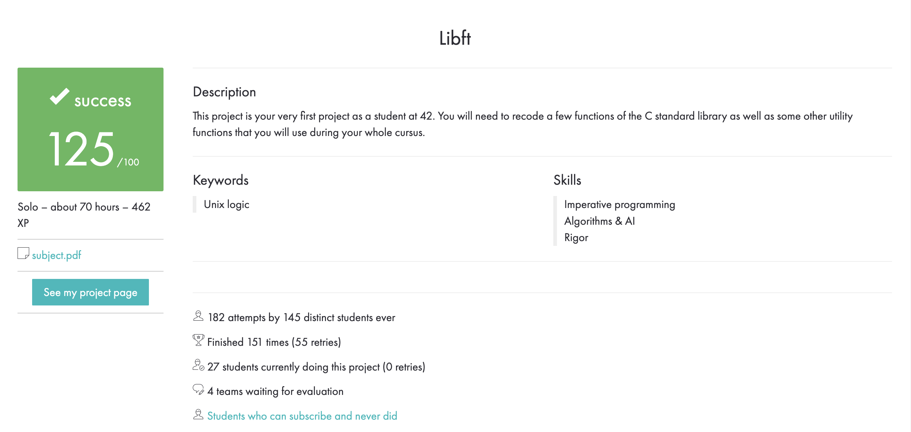

# Português 🇧🇷🇵🇹

<details>
  <summary>
    Saiba mais
  </summary>
  
  # Libft
Projeto da [42](https://www.42lisboa.com) - Rank 0 - Biblioteca de funções C

<details>
  <summary><strong>🏆 Meu desempenho</strong></summary><br />

  
</details>

## 📌 Habilidades

> Habilidades desenvolvidas:

- Utilização de ponteiros
- Noções de endereço de memória
- Noções de alocação e dealocação de memória
- Entendimento de lista encadeadas
- Entendimento sobre tipos
- Entendimento sobre struct
- Utilização de ponteiros para funções
- Manipulação de memória
- Conversão de números para strings e vice e versa

## ‍💻 Softwares necessários

- C compiler (clang)
- GNU make

## ⬇️ Compilando arquivos

```bash
	make #Compila todos as funções para a biblioteca 'libft.a'.
	make all #Faz exatamente a mesma coisa que apenas 'make'.
	make libft.a #Faz exatamente a mesma coisa que apenas 'make'.
	make bonus #Compila os arquivos do bonus.
	#PS: Todos os comandos listados acima criam a biblioteca, além de compilar as funções.
```

## ⚡ Testando o projeto

```
	Para testar este projeto é necessário um arquivo de teste, este ainda está a ser implementado.
```

## Time de desenvolvimento

> Projeto individual:

<table>
    <tr>
      <td>
        
        <h4 align="center">Alê Rabelo</h4>
      </td>
    </tr>
  </table>

## 💬 Contatos

<div align="center" style="display: inline_block">
  <a href="https://www.linkedin.com/in/al%C3%AA-emmanuel-rabelo-guedes/" target="_blank">
    
  </a> 
   <a href="mailto:rabeloguedes@proton.me">
     
  </a>
</div>

</details>

# English 🇺🇸🇬🇧

<details>
  <summary>
    More
  </summary>
  
  # Libft
Project from [42](https://www.42lisboa.com/) - Rank 0 - C library with some existing functions

<details>
  <summary><strong>🏆 My accomplishment</strong></summary><br />

  

</details>

## 📌 Skills

> Practiced skills:

- Usage of pointers
- Understanding of memory address
- Understanding of memory allocation and deallocation
- Understanding of linked list
- Understanding of types
- Understanding about struct
- Usage of pointers to functions
- Memory manipulation
- Conversion of numbers to strings and vice-versa

## ‍💻 Required Softwares

- C compiler (clang)
- GNU make

## ⬇️ Compiling files

```bash
	make #Compile all functions into the 'libft.a' library.
	make all #Do exactly what the above command does.
	make libft.a #Do exactly what the above command does.
	make bonus #Compile the bonus files.
	#PS: All the above commands, will create the library, not just compile the functions.
```

## ⚡ Testing the project

```
	In order to test this project, a test file is required, which is under development.
```

## Squad

> Single person project:

<table>
    <tr>
      <td>
        
        <h4 align="center">Alê Rabelo</h4>
      </td>
    </tr>
  </table>

## 💬 Contact

<div align="center" style="display: inline_block">
  <a href="https://www.linkedin.com/in/al%C3%AA-emmanuel-rabelo-guedes/" target="_blank">
    
  </a> 
   <a href="mailto:rabeloguedes@proton.me">
     
  </a>
</div>

</details>

# Deutsch 🇩🇪

<details>
  <summary>
    Mehr
  </summary>
  
  # Libft
Projekt von [42](https://www.42lisboa.com/) - Rank 0 - C Bibliotek mit einigen vorhandenen Funktionen

<details>
  <summary><strong>🏆 Meine Leistung</strong></summary><br />

  
</details>

## 📌 Fähigkeiten

> Ausgeübte Fähigkeiten:

- Verwendung von Zeigern
- Verständnis der Speicheradresse
- Verständnis der Speicherzuweisung und -freigabe
- Verständnis der verknüpften Liste
- Typenverständnis
- Verständnis für Struktur (struct)
- Verwendung von Zeigern auf Funktionen
- Speichermanipulation
- Konvertierung von Zahlen in strings und umgekehrt

## ‍💻 Benötigte Software

- C compiler (clang)
- GNU make

## ⬇️ Dateien zusammenstellen

```bash
	make #Kompilieren Sie alle Funktionen in die Bibliothek „libft.a“.
	make all #Machen Sie genau das aus, was der obige Befehl bewirkt.
	make libft.a #Machen Sie genau das, was der obige Befehl bewirkt.
	Bonus erstellen #Kompilieren Sie die Bonusdateien.
	#PS: Alle oben genannten Befehle erstellen die Bibliothek und kompilieren nicht nur die Funktionen.
```

## ⚡ Projekt Testing

```
	Um dieses Projekt zu testen, es wird eine Datei gebraucht, diese ist unter Entwicklung.
```

## Entwickungsteam

> Einzelperson Projekt:

  <table>
    <tr>
      <td>
        
        <h4 align="center">Alê Rabelo</h4>
      </td>
  </table>

## 💬 Kontakt

<div align="center" style="display: inline_block">
  <a href="https://www.linkedin.com/in/al%C3%AA-emmanuel-rabelo-guedes/" target="_blank">
    
  </a> 
   <a href="mailto:rabeloguedes@proton.me">
     
  </a>
</div>

</details>
